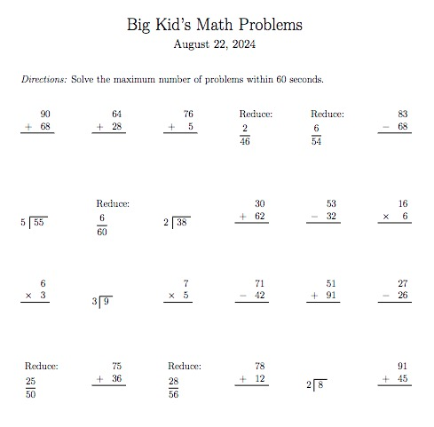

# math_hw
Math problems and/or homework for an elementary student (**little kid**) and an advanced elementary or middle school student (**big kid**). Python code generates math problems, with user configuration of number of problems, format, and problem type. Problem types include addition, subtraction, multiplication, division, fractions, and factorization. LaTex template defines the format of the output. Python 3.x code and TEX file are compiled in LaTeX compiler such as [Overleaf](https://www.overleaf.com/).

21Aug2024

---

### How to use:
Place both the PY and TEX files in the same directory and run the LaTeX compiler. The python file runs within the LaTex complier to generate the math problems. Edit the PY file to achieve the desired number range and problem type in the output. More info on LaTeX and compilers at: [LaTeX project](https://www.latex-project.org/) or [Overleaf](https://www.overleaf.com/learn)

### Example output:

